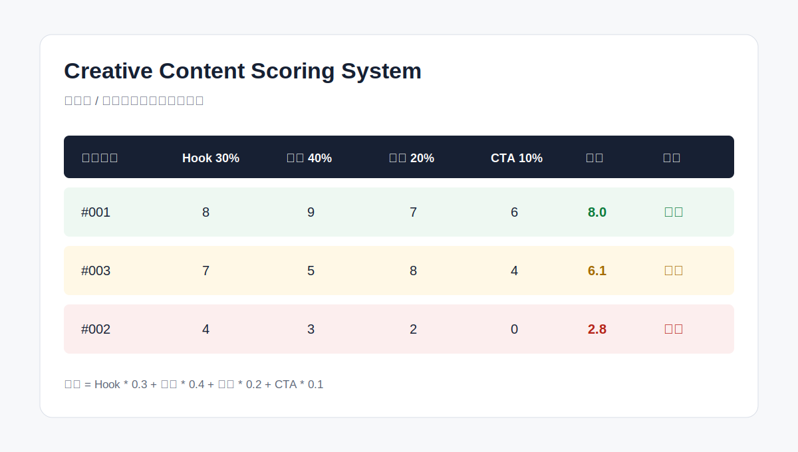

# Creative Content Scoring System

内容结构评分系统用于评估短视频、达人视频和广告素材的内容结构质量，帮助团队把原本偏主观的素材判断拆解为可量化、可复盘、可协作的评分标准。

该系统适用于投放前素材筛选、达人视频复盘、广告素材二创判断、复拍 Brief 输出，以及后续搭建 AI 自动评分和素材数据库。



## 项目背景

在内容投放和素材测试过程中，很多素材判断依赖个人经验：

- 这个视频开头抓不抓人？
- 证言是否可信？
- 卖点有没有讲清楚？
- 是否有明确的行动引导？
- 这条素材适合直接投放，还是只适合二次剪辑？
- 为什么有些素材看起来普通，但实际转化更好？

如果没有统一标准，团队很容易出现以下问题：

- 每个人对“好素材”的判断不一致
- 素材复盘只看结果，不看内容结构
- 达人素材无法沉淀为可复用经验
- 素材优化缺少明确方向
- 大量内容上线前缺少快速筛选机制

所以这个项目尝试建立一套可执行的内容结构评分方法，将内容判断从“凭感觉”转化为“有标准、有权重、有复盘”。

## 评分框架

| 模块 | 权重 | 评分说明 |
|---|---:|---|
| Hook | 30% | 开头是否抓眼球、停留力强、有引导力、有痛点或情绪引爆点 |
| 效果证言 | 40% | 是否有清晰真实的用户反馈、前后对比、功效证明、信任感建立、身份背书、权威背书等 |
| 卖点讲解 | 20% | 产品优势是否说清楚，有通俗解释功能点、带有可信力 |
| CTA 号召 | 10% | 是否有明确行动引导，如链接引导、口播引导、评论引导等 |

总评分公式：

```text
总分 = Hook * 0.3 + 效果证言 * 0.4 + 卖点讲解 * 0.2 + CTA * 0.1
```

每个模块满分为 10 分，最终得到 0-10 分的综合评分。

## 分档标准

| 等级 | 分值区间 | 定义说明 | 建议动作 |
|---|---:|---|---|
| 优保 | 7.0-10 | 内容结构完整，情绪带动好，效果真实，具备出潜力 | 主力投放、重点测新、推荐达人复拍 |
| 普通 | 4.0-6.9 | 有亮点但也有明显弱项，适合局部优化测试 | 常规测新、优化复拍 |
| 低质 | 0-3.9 | 无 Hook、无效果、无结构、无信息价值 | 不建议投放，淘汰处理 |

## 仓库结构

```text
.
├── README.md
├── docs/
│   └── scoring-rubric.md
├── templates/
│   └── content_scoring_template.csv
├── examples/
│   ├── example_input.csv
│   └── example_scored.csv
├── scripts/
│   └── score_content.py
├── assets/
│   └── scoring-system-preview.svg
└── LICENSE
```

## 快速使用

如果你只是想马上开始给素材打分，推荐直接下载 CSV 模板，然后导入 Google Sheets 或 Excel。

### 方式 1：下载评分模板

1. 打开 [`templates/content_scoring_template.csv`](./templates/content_scoring_template.csv)。
2. 点击 GitHub 页面右上角的 `Download raw file` 下载 CSV 文件。
3. 打开 Google Sheets，选择 `文件 -> 导入 -> 上传`，上传这个 CSV。
4. 导入位置建议选择 `新建电子表格`。
5. 为每条素材填写 `视频编号`、`达人/视频链接`、`Hook 30%`、`证言 40%`、`卖点 20%`、`CTA 10%` 和 `评语建议`。

Excel 用户可以直接双击打开 CSV，或在 Excel 中选择 `数据 -> 自文本/CSV` 导入。

### 方式 2：在表格里自动算分

Excel / Google Sheet 总分公式：

```text
=C2*0.3+D2*0.4+E2*0.2+F2*0.1
```

分档公式：

```text
=IFS(G2>=7,"优保",G2>=4,"普通",G2<4,"低质")
```

### 方式 3：用脚本批量算分

如果你已经有一批素材评分数据，可以用脚本自动计算 `总分` 和 `分档等级`：

```bash
python3 scripts/score_content.py examples/example_input.csv examples/example_scored.csv
```

脚本会自动输出：

- `总分`
- `分档等级`
- 基础错误提示，例如评分为空、评分不是数字、评分超出 0-10

## 建议评分表结构

| 视频编号 | 达人/视频链接 | Hook 30% | 证言 40% | 卖点 20% | CTA 10% | 总分 | 分档等级 | 评语建议 |
|---|---|---:|---:|---:|---:|---:|---|---|
| #001 | 示例链接 | 8 | 9 | 7 | 6 | 8.1 | 优保 | Hook 抓人，证言清晰，CTA 可强化 |
| #002 | 示例链接 | 4 | 3 | 2 | 0 | 2.9 | 低质 | 无结构，无有效演示 |

## 使用场景

- 达人视频筛选
- 广告素材上线前评估
- 素材复盘
- 素材二创判断
- 达人复拍 Brief
- 团队内部统一评分标准
- AI 辅助内容审核与打分
- 内容投放前的质量预判

## 后续优化方向

- 增加不同品类 / 不同平台的评分权重
- 增加短视频逐帧分析维度
- 增加素材标签体系，如痛点、场景、证言类型、卖点类型
- 接入素材表现数据，如 CTR、CVR、CPA、ROAS
- 建立素材评分与投放表现之间的关联分析
- 增加 AI 自动打分能力
- 搭建素材评分数据库和可视化看板

## License

MIT License. 仅供学习、研究与作品集展示使用。
